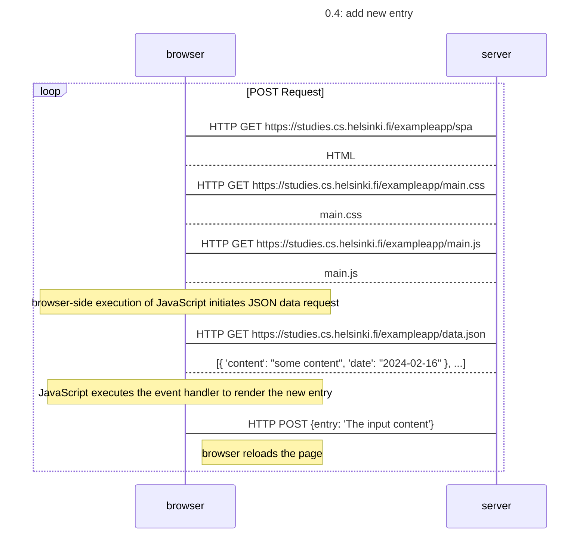

# 0.4: new note

```mermaid
sequenceDiagram
    Title: 0.4: add new entry

    loop POST Request
        browser->server: HTTP GET  https://studies.cs.helsinki.fi/exampleapp/spa
        server-->browser: HTML
        browser->server: HTTP GET https://studies.cs.helsinki.fi/exampleapp/main.css
        server-->browser: main.css
        browser->server: HTTP GET https://studies.cs.helsinki.fi/exampleapp/main.js
        server-->browser: main.js

        note over browser: browser-side execution of JavaScript initiates JSON data request

        browser->server: HTTP GET https://studies.cs.helsinki.fi/exampleapp/data.json
        server-->browser: [{ 'content': "some content", 'date': "2024-02-16" }, ...]

        note over browser: JavaScript executes the event handler to render the new entry

        browser->server: HTTP POST {entry: 'The input content'}

        note right of browser: browser reloads the page
    end
```